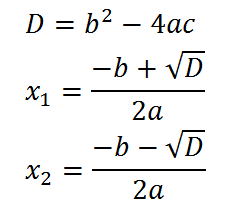

##  Корни квадратичной функции

Общий вид квадратичной функции одной переменной имеет следующий вид: `f(x) = ax2 + bx + c`, где `a`, `b` и `c` – константы и `a` не равна нулю.

Корни этой функции могут быть извлечены путем нахождения таких значений переменной `x`, для которых будет соблюдаться равенство `ax2 + bx + c = 0`. Эти значения могут быть вычислены с помощью формулы для корней квадратного уравнения, показанной ниже. Квадратичная функция может иметь от нуля до двух действительных корней.



Часть выражения под квадратным корнем называется дискриминантом. Если дискриминант отрицательный, квадратное уравнение не будет иметь действительных корней. В случае равенства дискриминанта нулю у квадратного уравнения будет ровно один действительный корень. Иначе корней будет два, и выражение необходимо будет вычислить дважды: один раз со знаком плюс, второй со знаком минус для числителя.

Напишите программу, вычисляющую действительные корни квадратичной функции. Сначала вы должны запросить у пользователя значения `a`, `b` и `c`. После этого должно быть выведено значения действительных корней функции.

Пример работы программы:

```text
Введите a: 1
Введите b: 2
Введите c: 3
Корней нет
```

```text
Введите a: 1
Введите b: -2
Введите c: 1
x = 1.0
```

```text
Введите a: 1
Введите b: -3
Введите c: 2
x1 = 2.0
x2 = 1.0
```
